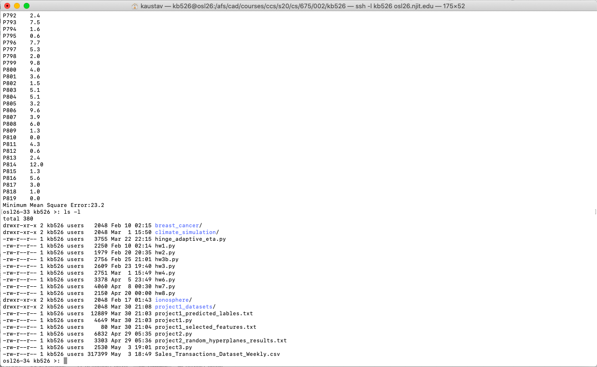

# Sales Transaction Prediction

## Objective
he weekly sales transaction dataset (posted here 
https://web.njit.edu/~usman/courses/cs675_spring20/Sales_Transactions_Dataset_Weekly.csv) 
shows weekly sales of over 800 items across a year. Your task is to predict the 
final week's sales from the previous values for each item in the dataset. Report 
your mean squared error which is defined as the mean squared error of your 
predictions 1/n(sum_i (y'i - yi)**2). The best mean squared that we achieve in this 
dataset is about 17.5 with ridge regression applied to an LSTM encoding of the data.

To qualify for full points you should achieve an MSE below 23.

You may use numpy, sklearn, and pandas in your solution. Your program should 
consider the last week 51 as the test data and prior weeks as training.

Submit your program that takes as input the dataset 
Sales_Transactions_Dataset_Weekly.csv and outputs the predictions of week 51 for 
each item and the mean squared error.

It's very important that your code does not consider the last column during training.
If it does we will have to assign a grade of 0. If the code is too complicated to
decipher and we cannot tell if you consider the last column we have no choice but
to assign a 0. 

To avoid such problems make it very clear in your code (with comments) that you
are considering the data only up to week 51 in the training and that week 52 is
clearly specified as test.

Directories: /afs/cad/courses/ccs/s20/cs/675/002/<ucid>.
For example if your ucid is abc12 then copy your programs into
/afs/cad/courses/ccs/s20/cs/675/002/abc12.

Your completed program is due before 1pm May 4th 2020

## How to run this program
python3 project3.py Sales_Transactions_Dataset_Weekly.csv

## Proof of Submission
Mean Square Error (MSE) = **23.2**

